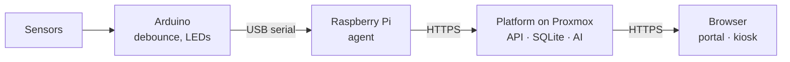

# Smart Bike Station – Hackathon Euregio

Every bike space, live – no more searching. The Smart Bike Station detects the occupancy of each
bike space, shows free spaces, recommends one and reports unusual movement as a **suspicion, never
as proof of theft**. Arduino, Raspberry Pi and Proxmox each have one clear job.

> Guiding principle: a reliably working chain from sensor to dashboard matters more than many
> half-finished features.



## Code map

| Folder | Responsibility | Entry point |
|---|---|---|
| `server/` | FastAPI platform: auth, tenants, stations, telemetry, AI evaluation, platform admin | `server/app/main.py` (`create_app`), CLI `python3 -m app.cli` |
| `server/app/routes/` | HTTP endpoints, one module per area (auth, org, stations, agent, platform) | `router` in each module |
| `agent/` | Raspberry Pi agent: Arduino → validated measurements → buffered HTTPS upload, heartbeat, self-update | `python3 -m bikeagent` (`agent/bikeagent/agent.py`) |
| `firmware/` | Arduino sketch + bill of materials and wiring | `firmware/smart_bike_station/smart_bike_station.ino` |
| `web/` | landing page, customer portal, kiosk display (plain HTML/CSS/JS modules, no framework) | `web/index.html`, `web/app.html`, `web/display.html` |
| `ml/` | data export, training, honest comparison rule vs. AI | `ml/train.py` |
| `deploy/` | Proxmox one-liner, server installer (own CA, no mail needed), systemd units, backup, firewall example | `deploy/proxmox/create-lxc.sh`, `deploy/install-server.sh` |
| `scripts/` | local development without hardware, translation check | `scripts/dev.sh`, `scripts/check-i18n.mjs` |
| `docs/` | architecture, agent, API, security/privacy, AI fact sheet, tests, operations | `docs/architecture.md` |

## What the platform offers

| Area | Content |
|---|---|
| **Landing page** `/` | features, how it works, security, plans, sign-up |
| **Customer portal** `/app` | overview, live view per station (occupancy, recommendation, warnings, heatmap, AI status), station management (spaces, pairing, display link), events with acknowledgement, team with roles and invitations, account & security (2FA, sessions), organisation (2FA requirement, export, deletion), plan & usage, audit log |
| **Kiosk display** `/display#<token>` | public read-only display for screens at the station (EN/DE/NL) |
| **Platform** `/app#/platform` | operator view: customers, plans, suspension, key figures |
| **Agent for the Raspberry Pi** `/install/agent.sh` | installation with a pairing code from the portal, heartbeat, remote configuration and commands, token rotation, self-update with checksum and rollback – see [docs/agent.md](docs/agent.md) |

Roles: **owner** (everything incl. plan/export/deletion) · **admin** (stations, devices, team) ·
**operator** (live data, acknowledge events) · **viewer**.

Security highlights (details: [docs/security-privacy.md](docs/security-privacy.md)): scrypt passwords
with a policy, TOTP 2FA with recovery codes (encrypted at rest, enforceable per organisation),
account lock-out and rate limits, server-side sessions with `__Host-`/HttpOnly/Secure/SameSite=Strict
cookies, CSRF token + origin check, strict tenant isolation, hashed device tokens per station, strict
CSP and security headers, trusted hosts, size limits, audit log, data export and deletion,
secure-by-default checks for `production`.

## Self-hosting on Proxmox (no domain, no mail server)

On the Proxmox host, in a copy of this repository:

```bash
bash deploy/proxmox/create-lxc.sh            # or: --ip 192.168.1.50/24 --gw 192.168.1.1
```

One command creates an unprivileged Debian 12 container and installs everything: HTTPS on
`https://<IP>` and `https://bikestation.local` with its own certificate authority (pinned by the
agents), HTTP→HTTPS redirect, daily backups. It ends with the URL, the CA fingerprint and a
**one-time setup link** for the first admin. Without a mail server, invitations and password
resets are handed over as link/QR code and new organisations need approval.
Details: [docs/operations.md](docs/operations.md). Other Debian 12 hosts: `sudo deploy/install-server.sh`.

## Quick start without hardware

Requirement: Python ≥ 3.11.

```bash
pip install -r server/requirements-dev.txt -r agent/requirements.txt
scripts/dev.sh
```

The script creates a demo customer with a station on the first start, starts the platform and pairs
a local agent (exactly as on the Pi) with its built-in simulator. Then:

- Portal: <http://127.0.0.1:8000/app> – sign in with `demo@example.org` / `Bike-Parking-Euregio-2026!`
- Kiosk link: printed in the console (`Kiosk display: …`)
- Own sign-up: <http://127.0.0.1:8000/app#/register> – the confirmation link appears in the log
- Gateway in the portal under **Gateways**: status, restart, renew token, updates
- Keyboard-controlled simulator: `scripts/dev.sh --interactive`, then `p A` (park/remove), `b A` (bump), `s A` (shake), `e A` (sensor fault), `q`

Connect a real Raspberry Pi: portal → station → Settings → **Set up gateway** and run the three
commands shown on the Pi ([docs/agent.md](docs/agent.md)).

Create a platform admin: `cd server && python3 -m app.cli create-platform-admin --email ops@example.org`

AI model for the pipeline check (simulated data): `python3 ml/generate_synthetic.py && python3 ml/train.py ml/data/synthetic.csv`

## Tests

```bash
cd server && python3 -m pytest -q    # acceptance tests, auth, 2FA, CSRF, tenant isolation, roles, plans, headers, agent management
cd agent && python3 -m pytest -q     # parser, buffer, watchdog, sequences, agent (state, updates, rollback, commands)
```

## Documentation

- [Architecture and data flow](docs/architecture.md)
- [Agent for the Raspberry Pi: installation, pairing, updates](docs/agent.md)
- [API and data format](docs/api.md)
- [Firmware, bill of materials and wiring](firmware/README.md)
- [Security and privacy](docs/security-privacy.md)
- [AI fact sheet](docs/ai-factsheet.md)
- [Test report](docs/test-report.md)
- [Operations: installation, restart, logs, backup, deletion](docs/operations.md)
- [Contributing: tests, versions, translations](CONTRIBUTING.md)

## Principles

- **Never "free" for an unknown sensor state.** Missing, stale (> 30 s) or faulty data means
  "unknown" – on the platform *and* additionally in the browser when the connection is lost.
- **No AI claim without a test.** `ml/train.py` compares model and rule on the same test runs; the
  visible warning comes from the better method (`alert_source`).
- **No accusation of persons.** No cameras, no names, no RFID.
- **No secrets in the repository.** Data key and SMTP password only via environment variables;
  device tokens are created in the portal and stored only as hashes.
