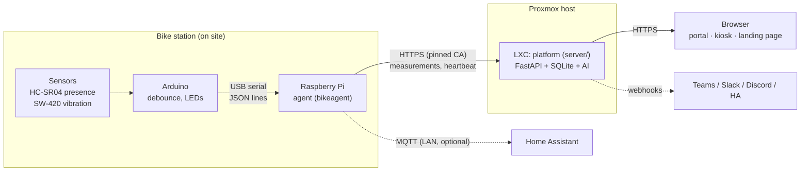

# Architecture

Concrete proposal following chapter 3 of the project plan. Adapt pins, thresholds and network
details to the hardware that is actually available.

## Components and responsibilities



| Platform | Responsibility | Code |
|---|---|---|
| Arduino | read sensors, debounce occupancy for 2 s, drive LEDs, send JSON lines over USB serial (on change, vibration at most every 0.5 s, heartbeat every 10 s) | `firmware/smart_bike_station/` |
| Raspberry Pi | validate lines, map slots, assign sequence numbers, buffer up to 500 messages, upload via HTTPS; if the Arduino is silent for > 15 s report every slot as a sensor error; report the network state back to the Arduino; heartbeat, remote configuration, self-update | `agent/bikeagent/` |
| Proxmox LXC (or VM / Docker) | FastAPI: accept measurements, derive states, evaluate rule + AI, SQLite, serve portal, kiosk and landing page | `server/`, `web/` |
| Browser | live occupancy, recommendation, warnings, timestamps, history; customer portal with roles, kiosk display via display link | `web/` |
| Home Assistant (optional) | entities per space via MQTT discovery – from the Pi agent, the add-on on the HA machine (instead of a Pi) or the agent container | `agent/bikeagent/mqtt.py`, `integrations/home-assistant/` |
| Other systems (optional) | read-only REST API with API keys; signed webhooks for warnings and gateway outages, delivered in a background thread with retries | `server/app/routes/integrations.py`, `server/app/webhooks.py` |

## Data flow

```
Bike is parked
  -> sensor measures distance / presence
  -> Arduino debounces (2 s) and reports {"slot_id","presence","vibration","seq","state"}
  -> Pi checks format/plausibility, maps the slot, assigns a sequence number
       +-> platform unreachable? -> buffer (bounded), resend later with age_ms
  -> platform checks device token + input, sets the server timestamp
       +-> SQLite: measurement (+ event on sensor fault / warning)
       +-> occupied + vibration: compute features -> rule and AI evaluate
  -> the dashboard polls the status every 2 s
       +-> new warning / sensor fault -> webhook dispatcher (queue, 3 attempts, SSRF-checked, signed)
  -> in parallel the agent publishes the raw occupancy to MQTT (LAN, works without the platform)

Maintenance loop (every 60 s): a paired gateway without heartbeat for > 3 min -> exactly one
"gateway_offline" event (+ webhook); its next heartbeat -> "gateway_online", the warning closes itself.
```

## States

```
[FREE] <-- bike detected / removed --> [OCCUPIED]
  | implausible reading / sensor failure / no data for 30 s
  v
[UNKNOWN] -- valid readings --> new state
[OCCUPIED] -- unusual vibration --> warning event (the space stays OCCUPIED)
```

A warning is not an occupancy state. "Unknown" is enforced in four places:

1. **Arduino**: after a start and after 5 invalid readings in a row `presence=-1`.
2. **Agent**: if the Arduino stops sending, it reports `sensor_state="error"` for every slot.
3. **Platform**: last message older than `stale_after_s` (30 s) -> `unknown/stale`.
4. **Browser**: last successful response older than 30 s -> every slot `unknown/connection`.

## Timing (planning assumptions, configurable)

| Value | Default | Where |
|---|---|---|
| Debounce | 2 s | `STABLE_MS` in the sketch |
| Heartbeat | 10 s | `HEARTBEAT_MS` in the sketch |
| Arduino timeout | 15 s | `GatewayConfig.arduino_timeout_s` in the agent |
| "unknown / stale" | 30 s | `timing.stale_after_s` in `server/config.toml` |
| Dashboard polling | 2 s | `timing.ui_poll_interval_s` |
| Grace period after an occupancy change | 15 s | `anomaly.grace_period_s` |
| Agent heartbeat | 60 s | `HEARTBEAT_S` in `server/app/routes/agent.py` |

## Why so simple?

No message broker, no Kubernetes, one database file, polling instead of WebSockets: less
integration and failure surface for a few demo spaces (plan 3.2). The agent only uses the Python
standard library plus pyserial so that the installation also works in networks with a proxy or
restricted internet access. MQTT is optional and purely local.
